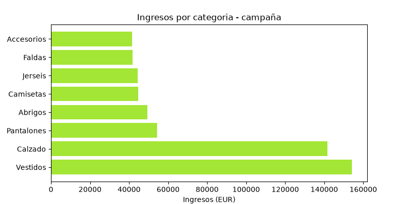
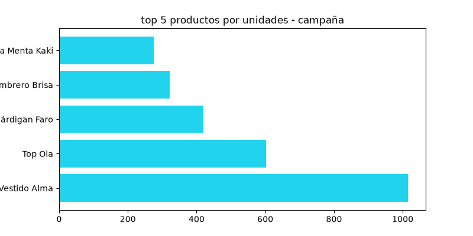
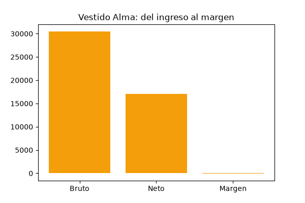
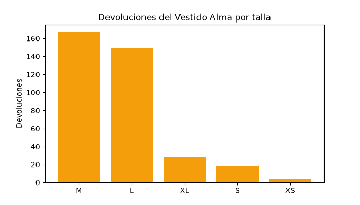

## 📊 BrightCart Data Analysis Project

## 💼 Executive Summary
This project analyzes a fashion e-commerce campaign.

At the top line, the campaign was a success: revenue and units sold increased during the sale period.

However, a deeper analysis of sales and returns shows that the best-selling product, `Vestido Alma`, was also the most returned item. That return pressure erased its profitability and left the product with a net margin of `-€60.31`.

### 🎯 Key Findings
- The campaign delivered higher revenue and higher unit volume.
- `Vestido Alma` was the top-selling product with `1,016` units sold.
- It generated `€30,473.90` in gross revenue and `€17,066.59` in net revenue after returns.
- Its return rate reached `42.7%`.
- Sizes `M` and `L` concentrated `86.3%` of all returns for that product.

### 🤝 Business Implication
Sales volume alone is not enough to judge performance. A product can lead revenue and still destroy margin if returns are high enough.

### ⭐ Recommendation
Pause or reduce restocking of `Vestido Alma` until sizing and return drivers are addressed.

### 📈 Key Visuals
### Revenue by category


### Top products by units


### Vestido Alma margin


### Vestido Alma returns by size



## 📁 Project structure
```
BrightCart Project/
├── data/                   # Main folder for data
│   ├── raw/                # Original data (immutable, never overwritten)
│   └── processed/          # Clean and final data ready for modeling or visualization
│
├── notebooks/              # Jupyter notebooks
│   ├── 01_initial_exploration.ipynb
│   ├── 02_cleaning.ipynb
│   └── 03_visualizations.ipynb
│
├── outputs/                # Generated reports, presentations, or dashboards
│   └── figures/            # Plots and images exported from notebooks
│
├── sql/                    # Querys
│   ├── 00_staging.sql      # Kpis Querys
│   ├── 01_Kpis.sql         # Kpis Querys
│   ├── 02_Kpis.sql         # Kpis Querys
│   ├── 03_Kpis.sql         # Kpis Querys
│   └── README.md           # how to run it
│

│
├── .gitignore              # Files and folders that Git should ignore (e.g., /data/raw, .env)
├── README.md               # Main project documentation (objectives, how to run it)
└── requirements.txt        # Python dependencies (pandas, matplotlib, seaborn, etc.)

```


## ▶️ How to Run the Staging Script

Before running the script, make sure you have **PostgreSQL** installed and that you're standing at the root of the repository (`proyecto_BrightCart`), since the script uses relative paths to read the CSVs from `data/processed/`.

### 1. Connect to the database

From a terminal, run:

```bash
psql -h localhost -U postgres -d brightcart
```

Enter the `postgres` user's password when prompted.

> **Note (Windows):** if `psql` is not recognized as a command, add the `bin` folder of your PostgreSQL installation (e.g. `C:\Program Files\PostgreSQL\18\bin`) to your system's `PATH` environment variable, or run the binary using its full path:
> ```powershell
> & "C:\Program Files\PostgreSQL\18\bin\psql.exe" -h localhost -U postgres -d brightcart
> ```

### 2. Run the script

Once inside the `psql` console, run:

```sql
\i sql/00_staging.sql
```

This will create the necessary tables, load the data from `data/processed/`, and leave the database ready for analysis.

## 🧰 Tech Stack 
- Analysis: Python, Pandas, PostgreSQL
- Visualization: Matplotlib
- Reporting: Jupyter Notebook
- Version Control: Git / GitHub

### 📝 Requirements
- PostgreSQL installed and running on `localhost`
- A database named `brightcart` already created
- The CSV files present in `data/processed/`


## 📌 Business Problem

The goal is to ensure the effectiveness of the campaigns implemented by the company.
## 👤 Autor

Jimmy Ramírez — [LinkedIn](https://www.linkedin.com/in/jimmy-ramirez-g) · [GitHub](https://github.com/jimmyramirezg6-blip)
